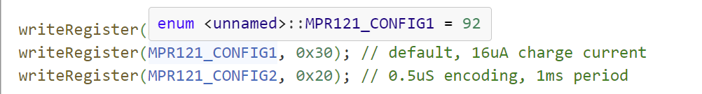
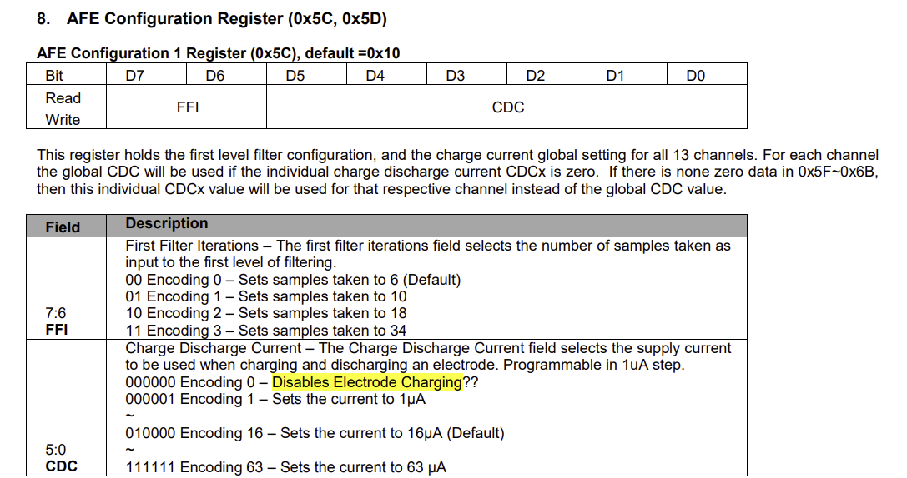

# ST-DIVA
DIY Controller for Project DIVA. Based on Arduino Leonardo/SparkFun Pro Micro.

## Wiring
### MPR121
|Leonardo/ProMicro|0x5A|0x5B|0x5C|
| ----------- |---|---| ----------- |
| 3.3V/VCC      | 3.3V | 3.3V  | 3.3V   |
|SCL   |  SCL |SCL   | SCL        |
|SDA   |  SDA |SDA   | SDA        |
|GND   |  GND |GND   | GND        |

You can adjust the I2C address by connecting ADDR to other pins:

ADDR not connected: 0x5A  
ADDR tied to 3V: 0x5B  
ADDR tied to SDA: 0x5C  
ADDR tied to SCL: 0x5D  

### Button
With `INPUT_PULLUP()`, the pin voltage will be pull up at `HIGH`. With a Button(aka a switch) to connect it to the ground, the voltage will be dropped to `LOW`.

Here I set `PIN6` to `PIN9` as `INPUT_PULLUP()`.

## MPR121
Here we use Adafruit MPR121 library.
### Sensitivity
When connected to external touchpad or other electrode, the RAW value change will be less obvious. So we need to change the parameter of MPR121.

Here we can see MPR121_CONFIG1 = 92. Which is 0x5C in hexadecimal.

Here, we can change the digit to adjust the charge value, which would affect the sensitivity.

By default, it would be `00010000`.

The first two `00` refer to set samples taken to 6.
The rest `010000` refer to set the current to 16uA.

Here we adjust it to `00110000`. Which means sets samples taken to 6 and sets the charge currrent to 30.

Binary `00011110` is hexadecimal `0x30`.

So here we set the parameter to `0x30`.

## Button&LED
Somehow when connected to MPR121, `pinMode(BUTTON_PIN, INPUT)` and `  pinMode(BUTTON_PIN, OUTPUT)` can't work properly.

So here I use `pinMode(BUTTON_PIN, INPUT_PULLUP)` to register the button pressing. And the LED can be connected like this. You can't control LED with program in this method.

